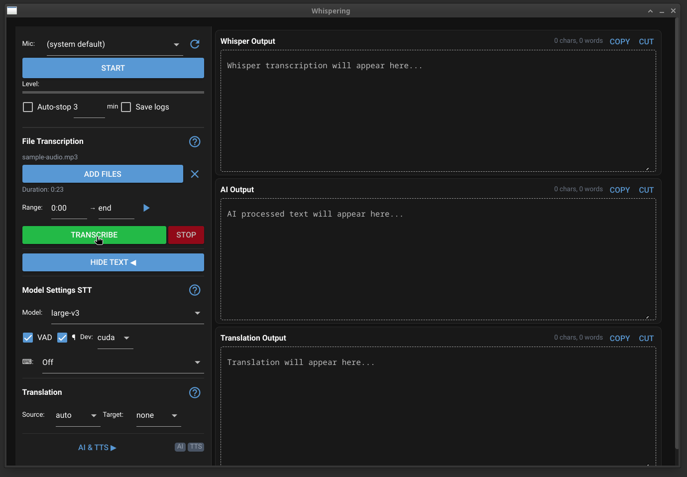

# Whispering 🎙️

**Version 1.3.0**

Real-time speech-to-text application with AI-powered translation, proofreading, voice commands, and voice cloning.

Whispering combines [faster-whisper](https://github.com/SYSTRAN/faster-whisper) for state-of-the-art speech recognition with modern AI models (Claude, GPT-4, Llama) to provide a powerful voice interface for your workflow.



##  Key Features

###  Transcription & Translation
- **Real-time Transcription**: Fast and accurate speech-to-text using Whisper models.
- **File Transcription**: Transcribe audio files (MP3, WAV, FLAC, M4A, OGG) with time range selection.
- **Live Translation**: Translate speech to 100+ languages instantly.
- **Auto-Type**: Dictate directly into any application (Word, Browser, IDE, Discord).
- **Smart Formatting**: Paragraph detection and automatic punctuation.

###  Voice Commands
- **Punctuation by Voice**: Say "comma", "period", "question mark" to insert punctuation.
- **Text Structure**: "New paragraph", "new line", "tab" for document formatting.
- **Multi-language Commands**: Speak commands in English, Hebrew, French, German, or Spanish.
- **Isolation Detection**: Commands are only triggered when spoken as standalone phrases (not mid-sentence).
- **Rich Text Output**: Output panels render HTML for formatted text display.

###  AI Powers
- **Intelligent Proofreading**: correct grammar and polish your spoken text.
- **Context-Aware Translation**: Nuanced translations that understand context.
- **Custom Personas**: Create specific AI assistants (e.g., "Summarize this", "Start a Story", "Q&A Mode").
- **Multi-Model Support**: Use Claude 3.5, GPT-4, Gemini, or Llama via OpenRouter.

###  Text-to-Speech (TTS)
- **Voice Cloning**: Upload a 5-second audio sample to clone any voice.
- **Read Aloud**: Listen to your transcripts or AI responses.
- **Save Audio**: Export generated speech to WAV/OGG files.

###  Session Management
- **Automatic Logging**: Secure JSONL logging of all sessions.
- **Crash Recovery**: Never lose a transcript, even if the app closes unexpectedly.
- **History**: Review past sessions organized by date.

##  Quick Start

### Installation

```bash
git clone https://github.com/Jemtaly/Whispering.git
cd Whispering
./scripts/install.sh
```

### Running the App

**Modern UI (Recommended)**
A responsive, dark-themed web interface built with NiceGUI.
```bash
./scripts/run_nicegui.sh
```

**Legacy GUI**
Classic desktop interface (Tkinter).
```bash
./scripts/run_tkinter.sh
```

##  Interface Guide

The Modern UI is divided into a control sidebar and dynamic output panels ("Whisper", "AI", "Translation").

- **Microphone**: Select your input device and monitor audio levels.
- **Model Settings**: Choose Whisper model size (Tiny to Large-v3) and device (CUDA/CPU).
- **AI Processing**: 
  - Enable to use LLMs for proofreading or custom tasks.
  - **Trigger Modes**: "Time" (every X seconds), "Words" (every X words), or "Manual" (Click "Process Now").
  - **Tasks**: Select a persona like "Proofread", "Simplify", or custom ones defined in settings.
- **Text-to-Speech**:
  - **Source**: Speak from Raw Transcript (W), AI Output (A), or Translation (T).
  - **Voice**: Upload a reference file to clone a voice instantly.
- **Voice Commands**:
  - Enable via the "Voice Commands" checkbox in the sidebar.
  - Speak command words as standalone phrases (pause before/after).
  - Commands are replaced with their text equivalents (e.g., "comma" → `,`).

##  Configuration

### AI Setup
To use AI features, you need an API key (OpenRouter recommended).
1. Copy the example config: `cp config/.env.example .env`
2. Edit `.env` and add your key: `OPENROUTER_API_KEY=sk-...`

### Custom Personas
Define your own AI assistants in `config/custom_personas.yaml`:
```yaml
summarizer:
  name: "Summarizer"
  prompt: "Summarize the following text into bullet points:"
```

### Voice Commands
Voice commands are defined in `config/voice_commands.yaml`. The default configuration includes:

**Supported Commands (Phase 1):**
| Voice Command | Inserts | Variants |
|---------------|---------|----------|
| "comma" | `,` | פסיק, virgule, komma, coma |
| "period" / "full stop" | `.` | נקודה, punkt, punto |
| "question mark" | `?` | סימן שאלה, fragezeichen |
| "exclamation mark" | `!` | סימן קריאה, ausrufezeichen |
| "new paragraph" | `\n\n` | פסקה חדשה, nuevo párrafo |
| "new line" | `\n` | שורה חדשה, nouvelle ligne |
| "colon" / "semicolon" | `:` / `;` | נקודתיים, doppelpunkt |
| "dash" / "ellipsis" | ` — ` / `...` | מקף, tiret |
| "open quote" / "close quote" | `"` | פתח/סגור מרכאות |
| "open paren" / "close paren" | ` (` / `) ` | סוגריים |
| "tab" | `\t` | indent |

**Detection Modes:**
- `isolation` (default): Command must be the entire spoken segment. "I need a comma here" won't trigger, but saying just "comma" will.
- `prefix`: Command must start with a wake word (e.g., "command comma").

**Adding Custom Commands:**
```yaml
commands:
  my_signature:
    action: insert_text
    insert: "\n\nBest regards,\nJohn Doe"
    triggers:
      en: ["sign off", "my signature"]
```

##  File Structure

```
Whispering/
├── config/
│   ├── ai_config.yaml          # AI model settings & prompts
│   ├── custom_personas.yaml    # Custom AI assistants
│   └── voice_commands.yaml     # Voice command definitions
├── logs/                       # Session logs organized by date
├── scripts/                    # Install & Run scripts
├── src/
│   ├── whispering_ui/          # Modern NiceGUI Application
│   │   ├── components/         # UI Widgets (Sidebar, Output, Help)
│   │   ├── bridge.py           # UI <-> Core Logic Bridge
│   │   └── main.py             # App Entry Point
│   ├── core_parts/             # Audio Device & Signal Processing
│   ├── ai_provider.py          # OpenRouter AI Integration
│   ├── commands_config.py      # Voice commands YAML loader
│   ├── command_detector.py     # Voice command pattern matching
│   ├── command_executor.py     # Voice command action dispatcher
│   ├── session_logger.py       # JSONL Logging & Recovery System
│   └── tts_controller.py       # TTS & Voice Cloning Logic
├── tts_output/                 # Generated Audio Files
└── tts_voices/                 # Uploaded Voice Reference Files
```

##  Requirements

### System Requirements
- **OS**: Linux (PipeWire/PulseAudio), Windows 10/11, or macOS.
- **Python**: 3.10 or higher.
- **GPU**: NVIDIA GPU with CUDA 12 recommended for real-time performance.

### Python Dependencies
The core dependencies are installed automatically by `install.sh`, but include:
- `faster-whisper`: Speech recognition engine.
- `nicegui`: Modern web-based UI framework.
- `sounddevice`: Low-level audio input.
- `pydub`: MP3 and other audio format support.
- `pywebview` & `PyQt6`: For running as a native desktop window.
- `pyautogui`: For the Auto-Type feature.

## Capturing System Audio

To capture speaker/system audio output on Linux with PipeWire:

**Option 1: pw-loopback (Recommended)**
```bash
# Run before starting Whispering:
pw-loopback --capture-props='media.class=Audio/Sink' --playback-props='media.class=Audio/Source'
```
Then select "pipewire" as your input device in Whispering.

**Option 2: pavucontrol**
1. Start Whispering and begin recording with "pipewire" selected
2. Open `pavucontrol` → Recording tab
3. Change Whispering's input to "Monitor of [your speakers]"

**Option 3: qpwgraph**
Use `qpwgraph` for visual JACK-style audio routing.

## Changelog

### Version 1.3.0
**New Features:**
- **Voice Commands (Phase 1)**: Control transcription with your voice
  - Punctuation: "comma", "period", "question mark", "exclamation mark", etc.
  - Structure: "new line", "new paragraph", "tab"
  - Quotes & Parens: "open quote", "close quote", "open paren", "close paren"
  - Multi-language triggers: Commands work in English, Hebrew, French, German, Spanish
  - Configurable via `config/voice_commands.yaml`
- **Rich Text Output Panels**: Output panels now render HTML instead of plain text
  - Enables formatted text display for future Phase 2 (bold, italic, headings)
  - Proper newline and tab rendering
  - XSS-safe HTML escaping

**Improvements:**
- Native clipboard operations (xclip/xsel/wl-copy) replace JavaScript clipboard API for PyQt6 compatibility
- Command word suppression prevents "comma" from flickering in preview before replacement
- Isolation heuristic: Commands only trigger when spoken as standalone phrases

**Voice Commands Roadmap:**
- **Phase 2** (Planned): Formatting commands (bold, italic, headings) with stateful detection
- **Phase 3** (Planned): User-defined macros (keystroke sequences)
- **Phase 4** (Planned): Dual-model architecture for low-latency command detection

### Version 1.2.3
**New Features:**
- **File Transcription**: Transcribe audio files (MP3, WAV, FLAC, OGG, M4A, etc.)
  - Single file, multiple files, or entire directory selection
  - Native file dialog using PyQt6
  - Time range selection (start/end time) for partial transcription
  - Audio playback with play/pause toggle and position scrubbing
  - Periodic auto-save during long file transcriptions
  - Crash recovery support for file transcription sessions
- **AI/TTS Status Indicators**: Visual indicators on the main panel showing when AI (green) or TTS (green) are enabled
- **MP3/M4A Support**: Added pydub fallback for audio formats not supported by libsndfile

**Improvements:**
- Play button now toggles play/pause and updates playback position
- File transcription uses dedicated queue to prevent result merging
- Better error handling for unsupported audio formats

### Version 1.2
**Improvements:**
- Text output now persists when recording stops (clears only when new transcription starts)
- Crash recovery properly restores text into the UI window
- Thread-safe clipboard operations prevent crashes during active transcription
- Clean shutdown handling (Ctrl+C exits gracefully)
- Simplified audio device selection

**Bug Fixes:**
- Fixed copy/cut crash when used during active transcription
- Fixed log recovery not displaying recovered text in main window

##  License

MIT License
